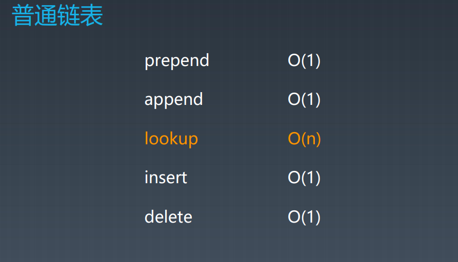
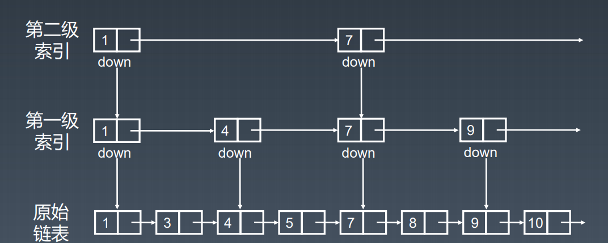

## 课程相关

| Y已添加进脑图            | 1     | 2            | 3               | 4     | 5    |
| ------------------------ | ----- | ------------ | --------------- | ----- | ---- |
| 283. 移动零 Y            | 10.19 | 10.19        | 10.20(做的不好) | 10.24 |      |
| 26. 删除数组中的重复项 Y | 10.23 | 10.23        | 10.24           |       |      |
| 88. 合并两个有序数组 Y   | 10.24 | 10.24        | 10.25           |       |      |
| 11. 盛最多水的容器 Y     | 10.19 | 10.19        | 10.20           | 10.25 |      |
| 70. 爬楼梯               | 10.19 | 10.19        | 10.20           | 10.25 |      |
| 1. 两数之和 Y            | 10.24 | 10.24        | 10.25           |       |      |
| 15. 三数之和 Y           | 10.20 | 10.20        | 10.21           | 10.25 |      |
| 206. 反转链表Y           | 10.21 | 10.21        | 10.22           | 10.25 |      |
| 24. 两两交换链表中的值 Y | 10.21 | 10.21        | 10.22           | 10.25 |      |
| 21. 合并两个有序链表 Y   | 10.23 | 10.23        | 10.24           |       |      |
| 84. 柱状图中最大的矩形   | 10.23 | 10.23（难）  |                 |       |      |
| 239. 滑动窗口最大值      | 10.23 | 10.23 （难） |                 |       |      |
| 189. 旋转数组 Y          | 10.24 | 10.24        | 10.25           |       |      |
| 641. 设计双端循环队列Y   | 10.24 | 10.24        | 10.25           |       |      |
| 42.接雨水                | 10.24 | 10.24        |                 |       |      |

## 每日一题

|                 | 1     | 2     | 3     | 4     | 5    |
| --------------- | ----- | ----- | ----- | ----- | ---- |
| 70. 爬楼梯      | 10.19 | 10.19 | 10.20 |       |      |
| 66. 加一 Y      | 10.20 | 10.20 | 10.21 | 10.25 |      |
| 925. 长按键入   | 10.21 | 10.21 | 10.22 |       |      |
| 299. 猜数字游戏 | 10.24 | 10.24 |       |       |      |

学习笔记

## 数组(Array List)

- 申请数组时Memory Controller会开辟一块连续的内存空间
- 通过Memory Controller访问数组，时间复杂度仅仅为O(1)
- 可以随机访问任何一个元素
- 对于插入和删除来说，数组并不是特别好用，时间复杂度都为O(n)

## 链表

### 时间复杂度

## 跳表

将有序的链表变为跳表

对标的是平衡树和二分查找，出现的比较晚

跳表查询数据的时间复杂度为O(logn),空间复杂度为O(n)。

==贯穿整个数据结构中的思想，牢记==

1.  升维

2.  用空间换取时间

## 工程中的应用

### 双端链表中的应用 LRU Cache

https://www.jianshu.com/p/b1ab4a170c3c
https://leetcode-cn.com/problems/lru-cache/

### 跳表应用在Redis数据库中

https://redisbook.readthedocs.io/en/latest/internal-datastruct/skiplist.html
https://www.zhihu.com/question/20202931

##  普通的栈，队列

### 时间复杂度

查找: O(n)

添加，删除：O(1)

双端队列应用场景更加广泛

##优先队列

插入操作：O(1)

取出操作：O(logn),按照元素的优先级取出

底层数据结构:

可能是heap,bst,treap来实现

## Java源码分析

平时用的java比较少，大致翻了翻源码，看了看博客，没有总结。

