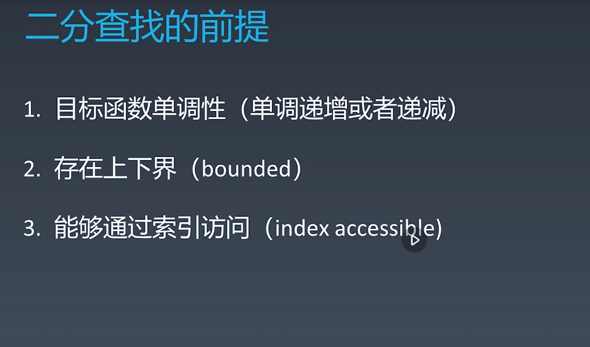
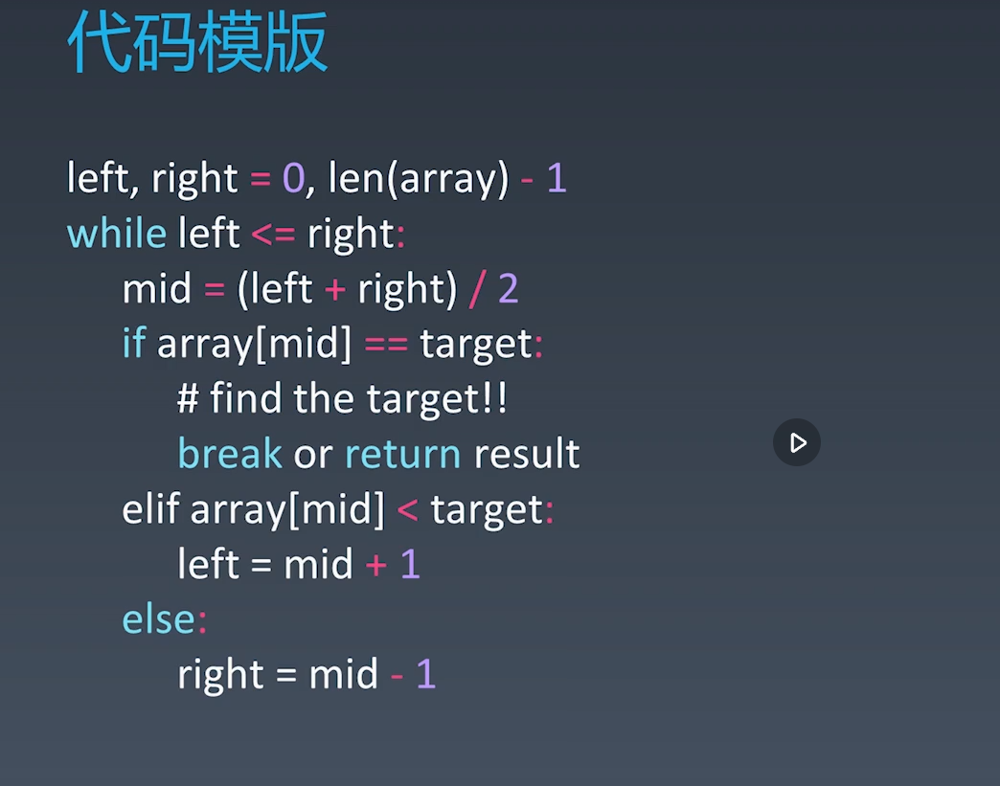

学习笔记

|                                 | 1     | 2     | 3     | 4    | 5    |
| ------------------------------- | ----- | ----- | ----- | ---- | ---- |
| 200. 岛屿数量                   | 11.10 | 11.10 | 11.11 |      |      |
| 127. 单词接龙                   | 11.10 | 11.10 | 11.11 |      |      |
| 529. 扫雷                       | 11.11 | 11.11 | 11.12 |      |      |
| 55，跳跃游戏                    | 11.11 | 11.11 | 11.15 |      |      |
| 122. 买卖股票的最好时机         | 11.11 | 11.11 | 11.15 |      |      |
| 860. 柠檬水找零                 | 11.12 | 11.12 | 11.15 |      |      |
| 874. 模拟行走机器人             | 11.12 | 11.12 | 11.15 |      |      |
| 455. 分发饼干                   | 11.12 | 11.12 | 11.15 |      |      |
| 45. 跳跃游戏II                  | 11.12 | 11.12 | 11.15 |      |      |
| 328. 奇偶链表                   | 11.13 | 11.13 | 11.15 |      |      |
| 74. 搜索二维矩阵                | 11.14 | 11.14 | 11.15 |      |      |
| 153. 寻找旋转排序数组中的最小值 | 11.14 | 11.14 | 11.15 |      |      |
| 33. 搜寻旋转排序数组中          | 11.14 | 11.14 | 11.15 |      |      |
| 367. 有效的完全平方数           | 11.14 | 11.14 | 11.15 |      |      |
| 69. x的平方根                   | 11.14 | 11.14 | 11.15 |      |      |

## 深度优先搜索和广度优先搜索

### 深度优先遍历


递归表示法


迭代表示法


### 广度优先


心得：进行深度优先时，如果遇到图可以标记的那种，往往不需要额外的数组去记录是否访问过

​	广度一般都是要进行记录的

## 贪心算法


## 二分查找






## 四步解法

1. 交流，clarification
2. 提出多种方法，分析每种方法的时间复杂度和空间复杂度 
3. 代码实现
4. 测试用例，corner case等

##  思考题

- 使用二分查找，寻找一个半有序数组 [4, 5, 6, 7, 0, 1, 2] 中间无序的地方
  说明：同学们可以将自己的思路、代码写在第 4 周的学习总结中

这个问题和153. 寻找旋转排序数组中的最小值思路时一样的


如果数组没有翻转，即 nums[left] <= nums[right]，则 nums[left] 就是最小值，直接返回。

如果数组翻转，需要找到数组中第二部分的第一个元素：


下面讨论数组翻转的情况下，如何收缩区间以找到这个元素：

若 nums[left] <= nums[mid]，说明区间 [left,mid] 连续递增，则最小元素一定不在这个区间里，可以直接排除。因此，令 left = mid+1，在 [mid+1,right] 继续查找

否则，说明区间 [left,mid] 不连续，则最小元素一定在这个区间里。因此，令 right = mid，在 [left,mid] 继续查找
[left,right] 表示当前搜索的区间。注意 right 更新时会被设为 mid 而不是 mid-1，因为 mid 无法被排除。

```go
// 代码实现
func findMin(nums []int) int {
    low, high := 0, len(nums)-1
    for low <= high {
        if nums[low] <= nums[high] {
            return nums[low]
        }
        mid := low + (high - low) / 2
        if nums[mid] >= nums[low] {
            low = mid + 1
        } else {
            high = mid
        }
    }
    return -1
}
```


