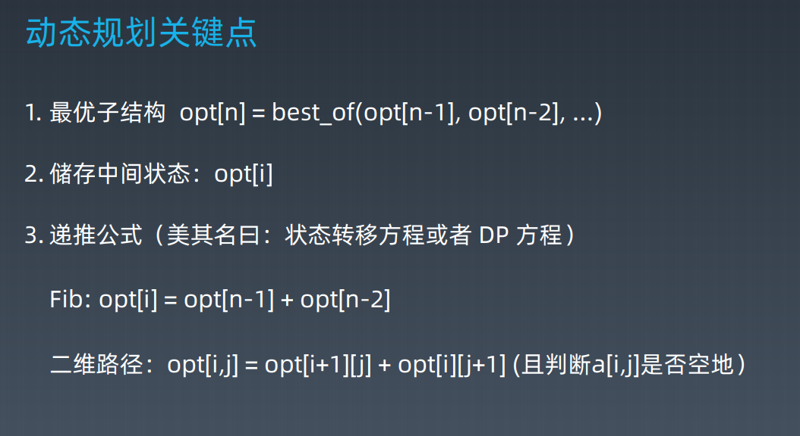

学习笔记

学习笔记

|                       | 1     | 2     | 3     | 4    | 5    |
| --------------------- | ----- | ----- | ----- | ---- | ---- |
| 70. 爬楼梯            | 11.24 | 11.24 | 11.25 |      |      |
| 62. 不同路径          | 11.24 | 11.24 | 11.25 |      |      |
| 1143. 最长公共子序列  | 11.24 | 11.24 | 11.26 |      |      |
| 322. 零钱兑换         | 11.25 | 11.25 | 11.28 |      |      |
| 198. 打家劫舍         | 11.26 | 11.26 | 11.28 |      |      |
| 213. 打家劫舍ii       | 11.26 | 11.26 | 11.28 |      |      |
| 152. 乘积最大子数组   | 11.28 | 11.28 |       |      |      |
| 75. 颜色分类          | 11.24 | 11.24 | 11.28 |      |      |
| 120. 三角形最短路径和 | 11.24 | 11.24 | 11.28 |      |      |
| 64. 最小路径和        | 11.29 | 11.29 |       |      |      |
| 91. 解码方法          | 11.25 | 11.25 | 11.29 |      |      |
| 72. 编辑距离          | 11.26 | 11.26 | 11.29 |      |      |
| 32. 最长有效括号      | 11.26 | 112.6 | 11.29 |      |      |

### 递归模板

1. terminator
2. process
3. drill down
4. reverse the state

### 分治模板

1. terminator

2. prepare data

3. conquer subproblem

4. process and generate the final result

5. reverse if needed

   我觉得这里是和递归一样的

## 感触

- 人脑的递归非常低效，很累
- 找到最近最简单方法，将其拆分可重复解决的问题
- 数学归纳法思维（抵制人肉递归的诱惑）

==本质：寻找重复性->计算机指令集==

画递归树

## 动态规划

理解为动态递推

DP 和 分治是有内在联系的

关键点：

- 本质上和递归和分治没有根本上的区别（关键看有无最优的子结构）

- 共性：找到重复子问题
- 差异性：最优子结构，中途可以淘汰次优解

思考

递归（记忆化搜索） -> dp

## 感悟

回溯和动态规划的感悟

回溯（暴力加剪枝）：这种问题一般都是很难发现最优子问题，只能通过暴力搜索每一种情况，来获取答案。

记忆化递归和动态规划本质上是一样的：通过存储dp状态表或者备忘录来实现问题的优化。 

对于大部分的题目来说，记忆化递归和动态规划时间复杂度远远小于回溯的，但是有一些题目我们发现通过大量的剪枝，回溯的时间复杂度是可以小于DP的例如：

https://leetcode-cn.com/problems/coin-change/，

当然这种情况比较corner,在一些题目中确实是这样，可以留意下题目中的回溯剪枝解法和DP解法，当然可以用DP解决重要掌握的还是动态规划，剪枝一般不太好想。 

不要去想记忆化递归的剪枝，没有任何意义。

记忆化递归有时候会快于动态规划，因为有的时候动态规划需要遍历整个二维数组，而记忆化递归因为某些条件可以省去一些计算。例如： https://leetcode-cn.com/problems/edit-distance/